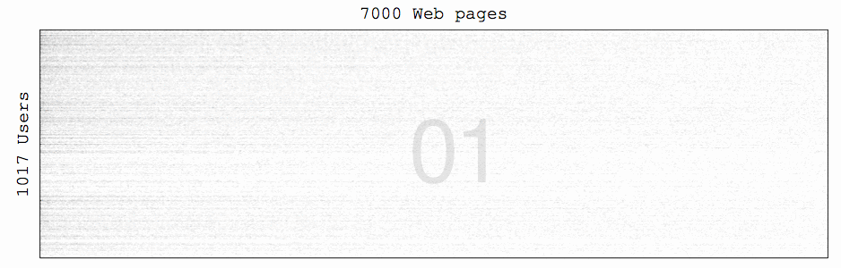

## User Modeling in Folksonomies: Relational Clustering and Tag Weighting

### Reference

Takuya Kitazawa and Masahide Sugiyama **User Modeling in Folksonomies: Relational Clustering and Tag Weighting**. In *Proc. of WIMS'15*, July 2015. (to appear)

### The Infinite Relational Model

Our paper deeply refers the Infinite Relational Model (IRM) proposed by C. Kemp et al. Source code developed by the author is available at http://www.psy.cmu.edu/~ckemp/code/irm.html

Experiments in this study consider dataset described below, with applying this source code. IRM-based relational clustering iteratively works as:



Unfortunately, the code may not work (segmentation fault occurs) under incompatible environments. We guess that the program has some minor issues around memory management. For reference, our environment is:

```
Vine Linux 6.3 (32bit)
Intel(R) Core(TM) i7-2600 CPU @ 3.40GHz
4GB RAM
```

### Dataset

Dataset used in this paper is available at https://dl.dropboxusercontent.com/u/4844005/WIMS2015_dataset.zip

Open the .zip file, and you can find:

```
.
├── 5-fold
│   ├── output
│   ├── test
│   └── train
├── IRM_output
│   ├── page_assignments
│   ├── status
│   └── user_assignments
├── bookmarks.graph
└── pages.json
```

`bookmarks.graph` is an input to IRM-based relational clustering, and outputs are in a directory named `IRM_output`. For more detail about how to understand the outputs, please refer README file of the IRM code.

`pages.json` includes complete information of 7,000 web pages as follows. Note that, since the authors focused on [Hatena Bookmark](http://b.hatena.ne.jp/), a Japanese social bookmarking service, most of data is written in Japanese.

```
[
  {
    "title": "${web page title}",
    "url": "${url}",
    "tags": {
      "${tag #1}": ${frequency of tag #1},
      "${tag #2}": ${frequency of tag #2},
      "${tag #3}": ${frequency of tag #3},
      ...
    },
    "bookmark": ${number of bookmarks}
  },
  {
    ...
  }
]
```

Importantly, ordering in `pages.json` corresponds to indices of the third column in `bookmarks.graph`.

### Code

We disclose a python script `weighting.py` to generate the same results as Fig. 7 and 8 in our paper. This script reads the IRM outputs and page information, and compute overall tag weights based on the equations shown in section 4.1.

```
$ python weighting.py
```

The program has eta(9, ell), strength between each web page cluster and 9-th user cluster, as a list. These values are pre-computed based on the IRM outputs.

Also, `recommend.py` will make recommendations and evaluate based on F-measure and running time, as discussed in Section 5. 

```
$ python recommend.py
```

This code reads outputs from each cross validation step, and evaluates by using test data. Finally, average F-measure and running time will appear. Note that it will run for quite a long time, especially during user-based collaborative filtering (CF). The implementation of CF is closed because it was written by the other programmer.